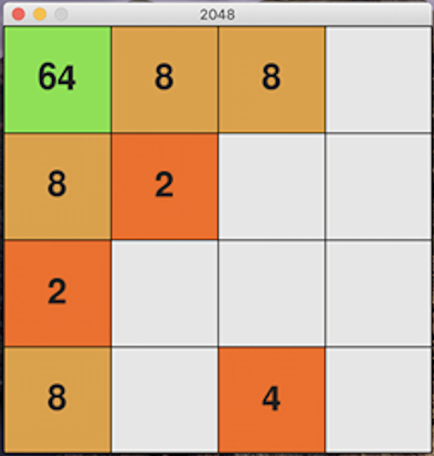

# 2048 GAME

This is a 2048 game. It's made using `Python` and `PyGame` framework.

### Installing the game:
- First you must have Python installed: [Python](https://www.python.org/downloads/) 
- You need to clone this repository: https://github.com/mihsim/PyGame_2048.git
- Using Terminal or CMD to go into the main directory of this project (it has `app.py`)
- Run the following commands:
    ```
    >>> pip install -r requirements.txt
    ``` 
  
### Starting the game:
- Using Terminal or CMD to go into the main directory of this project (it has `app.py`)
- Run the following commands:
    ```
    >>> python3 app.py
    ```
### Playing the game:
- Use arrows to move blocks
- Use `q` to quit the game
- Once the game is over, use `n` to start a new game.


### Good Luck


